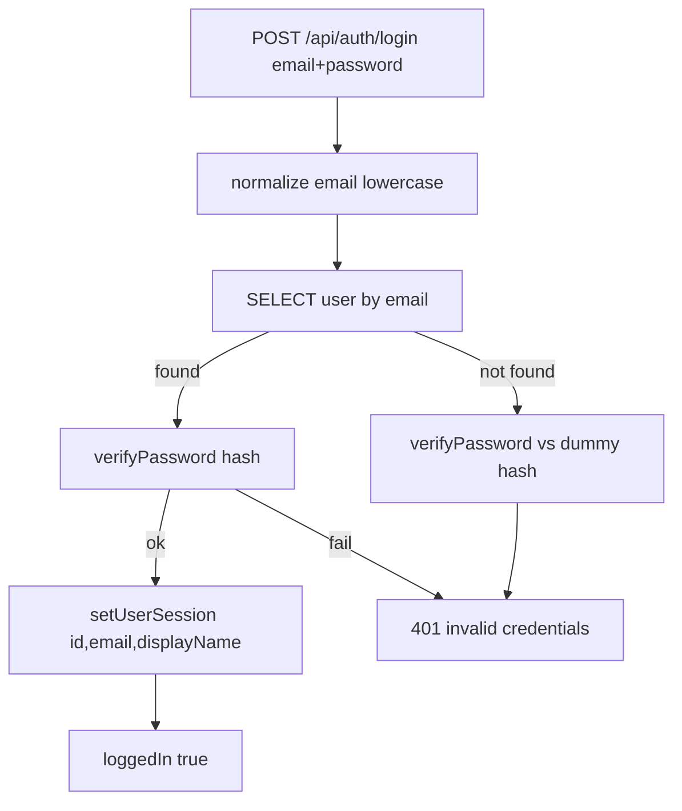

## Context

This is the first domain table in the project, so its choices become project-wide conventions and are deliberately durable. Password hashing, session shape, ID generation, and email handling were aligned with the user across prior explore rounds; this change records and implements them. The DB plumbing (`db` client, `db:generate`/`db:migrate`) already exists, but `users` is the first real domain table.

## Goals / Non-Goals

**Goals:**

- Add a `users` table and verify real, hashed credentials at login.
- Establish UUIDv7 + camelCase column conventions for all future tables.
- Make MVP login usable via an idempotent env-var bootstrap user.
- Add brute-force protection on the login endpoint.

**Non-Goals:**

- Self-registration, password reset, account deletion, profile management, 2FA, SSO (all V1.1+).
- Email verification columns and a multi-replica shared rate-limit store.

## Decisions

**D1 — UUIDv7 generated by PostgreSQL via native `uuidv7()` (Postgres 18+).**
`id` is `uuid PRIMARY KEY DEFAULT uuidv7()`. The user accepted **PostgreSQL ≥ 18 as a minimum**, so we use the DB-native generator. Benefits: time-ordered UUIDs (good index locality), correct values for **all** inserts including raw SQL/seed scripts, zero new dependency. *Alternatives rejected:* app-side `uuidv7` npm `$defaultFn` (portable to older PG but adds a dep and misses non-Drizzle inserts); `pg_uuidv7` extension (needs superuser `CREATE EXTENSION`); `serial` (enumerable, leaks counts).

**D2 — Password hashing via `nuxt-auth-utils` `hashPassword`/`verifyPassword`.**
Already installed (scrypt, per-hash salt, PHC-style self-describing string). Store a **single `passwordHash` text column** — never plaintext, never a separate salt column. *Alternatives rejected:* hand-rolled `node:crypto` scrypt (reinvents the lib); bcrypt/argon2 (new native dep, complicates the self-hosted Docker image).

**D3 — Email is the identity; store normalized lowercase + UNIQUE.**
Normalize once at the boundary (`email.trim().toLowerCase()`) and store only the normalized form; the UNIQUE index dedups `Bob@x.com` vs `bob@x.com`. `username` is removed from endpoint, session, UI, and spec scenarios. *Alternative rejected:* Postgres `citext` (extra extension, opaque comparisons).

**D4 — Timing-safe login failure.**
When the email is unknown, verify the password against a dummy hash so "unknown email" and "wrong password" are indistinguishable in response and timing (anti-enumeration).

**D5 — Session payload `{ id, email, displayName }`.**
`id` is the durable key future per-user queries scope on (NFR 8.7); `email`/`displayName` are display-only. `displayName` is nullable, so the session type treats it as optional.

**D6 — Env-var bootstrap user, run in the dedicated migrate step.**
Since self-registration is V1.1, the first MVP user is seeded from `BOOTSTRAP_USER_EMAIL` + `BOOTSTRAP_USER_PASSWORD` in the migrate step (consistent with add-database D4), keeping it out of the request process. Idempotent: skip silently if unset; skip if the user exists; **never reset an existing user's password**. *Alternative rejected:* nitro startup plugin (runs per-process, in the request runtime).

**D7 — Login rate limiting via `nuxt-security` `rateLimiter`.**
Keep the global limiter on; add a stricter per-route override on `POST /api/auth/login` (OWASP / NFR 8.3). *Alternative rejected:* hand-rolled IP+email middleware (most code and its own storage concerns, overkill for MVP).

### Data Model

```sql
CREATE TABLE users (
  id            uuid        PRIMARY KEY DEFAULT uuidv7(),  -- Postgres 18 native
  email         text        NOT NULL UNIQUE,               -- stored lowercased
  passwordHash  text        NOT NULL,                      -- scrypt PHC string
  displayName   text,                                      -- nullable (wbs 1.5)
  createdAt     timestamptz NOT NULL DEFAULT now(),
  updatedAt     timestamptz NOT NULL DEFAULT now()
);
```

Drizzle (`server/db/schema/users.ts`), camelCase columns:

```ts
import { pgTable, uuid, text, timestamp } from 'drizzle-orm/pg-core';
import { sql } from 'drizzle-orm';

export const users = pgTable('users', {
  id: uuid('id').primaryKey().default(sql`uuidv7()`),
  email: text('email').notNull().unique(),
  passwordHash: text('passwordHash').notNull(),
  displayName: text('displayName'),
  createdAt: timestamp('createdAt', { withTimezone: true }).notNull().defaultNow(),
  updatedAt: timestamp('updatedAt', { withTimezone: true }).notNull().defaultNow(),
});
```

### Login flow



## Risks / Trade-offs

- **Postgres 18 hard requirement** (`uuidv7()` errors on older servers) → already pinned in `docker-compose.yml` + e2e harness; document the minimum in `.env.example`/README.
- **Rate limiter in-memory store** not shared across replicas → acceptable for single-container MVP; documented follow-up to point at a shared store (e.g. Redis) when scaling.
- **Bootstrap secret handling** (`BOOTSTRAP_USER_PASSWORD`) → must be hashed before insert and never logged; documented in `.env.example`.
