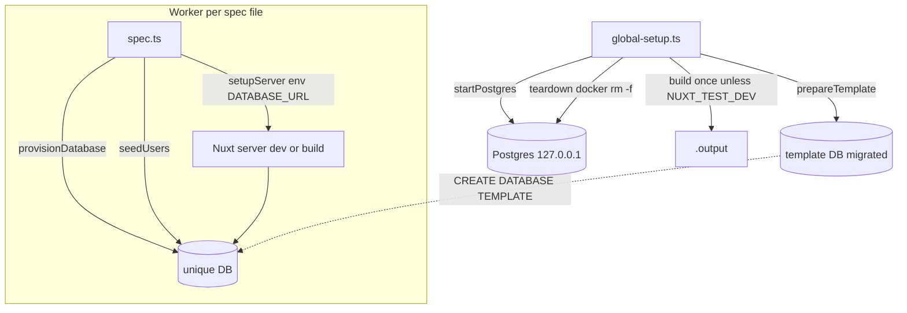

## Context

The e2e suite (`test/e2e/*.spec.ts`) is slow (>5 min) and inconsistent. Today:

- `vitest.config.ts` e2e project sets `globalSetup: test/e2e/support/global-setup.ts`, `fileParallelism: false`, `hookTimeout: 600_000`, `testTimeout: 60_000`.
- `support/global-setup.ts` runs `startPostgres()` + `runMigrations()` against ONE shared DB.
- `support/postgres.ts` manages one container `osi-time-tracker-e2e-pg`, one DB `osi_time_tracker_test` at `host.docker.internal:54800`; `stopPostgres()` is a **no-op**.
- Each spec repeats: top-level `process.env.DATABASE_URL`, `startPostgres()` in `beforeAll` (180s), an inline scrypt hasher + `TRUNCATE users` + reseed, and inconsistent guards (`describe.skip` for docker specs; `if/else` for browser specs which don't guard Docker).
- `db.spec` tests the migrator directly (no Nuxt server).
- A `test/nuxt/page-render.spec.ts` already mounts `LoginPage` via `mountSuspended`.

The single shared DB is what forces `fileParallelism: false`: parallel files would race on `TRUNCATE users`.

## Goals / Non-Goals

**Goals:**
- Fast, deterministic, parallel-safe e2e suite where each spec declares *what* it needs (DB, seeded users, maybe a browser).
- CI-ready with Docker; graceful local skips without Docker/browser.
- Zero lingering containers/processes after a run.
- Optional fast local mode without a production build.

**Non-Goals:**
- New behavioral test coverage.
- Moving `i18n-login` to the `nuxt` environment (stays e2e).
- Merging `auth.spec` + `clients.spec`.
- Authoring CI workflow files.

## Decisions

1. **DB-per-file via template clone.** `global-setup` migrates one template DB once; each spec runs `CREATE DATABASE <unique> TEMPLATE <tpl>` (fast file copy) and gets its own URL. *Alternative: schema-per-file (one DB, per-file `search_path`)* — rejected: more app-side coupling and a less natural isolation boundary than a separate database.

2. **`fileParallelism: true`.** Safe because each Vitest spec file runs in its own worker process → isolated `process.env.DATABASE_URL`. *Alternative: keep serial + only dedupe boilerplate* — rejected: leaves the dominant serial server-boot cost in place.

3. **Build-once, reuse for CI.** `global-setup` builds `.output` once; specs use `setup({ build: false })`. Per-file env (`DATABASE_URL`, `NUXT_SESSION_PASSWORD`) is injected via `setup({ env })` because the prebuilt output bakes `runtimeConfig`. *Alternative: build per spec (`build: true`)* — rejected: redundant builds dominate cost even when parallelized.

4. **Two-mode harness via `NUXT_TEST_DEV`.** Set → `setup({ dev: true })` (`nuxi dev`, no build); unset → build-once + `setup({ build: false })`. Dev = fast local signal; build = CI-faithful. *Alternative: single mode* — rejected: forces a slow local loop or sacrifices CI fidelity.

5. **Teardown removes everything.** `stopPostgres()` becomes `docker rm -f`; per-file servers are already stopped by test-utils' own `afterAll(stopServer)`.

6. **Concurrency cap.** Bound Vitest `poolOptions`/`maxWorkers` (e.g. `min(4, cpus/2)`) so parallel boots don't thrash CPU — more critical in dev mode (heavier boots).

7. **No per-file `DROP DATABASE`.** Rely on `docker rm -f` at teardown; bulk-clean leftover `osi_time_tracker_*` DBs at `prepareTemplate` for the container-reuse case. *Alternative: per-file drop in `afterAll`* — rejected: the server pool may still hold connections.

8. **`db.spec` special-cased.** Uses `provisionEmptyDatabase()` (clone `template0`) per test since it validates the migrator.

9. **`127.0.0.1` over `host.docker.internal`** for portability across CI and local.

10. **Shared `NUXT_SESSION_PASSWORD`** passed per-file via `setup({ env })` from a single harness constant (explicit + DRY).

### Target shape

```
test/e2e/support/
  postgres.ts      (modified: 127.0.0.1, stopPostgres = docker rm -f)
  database.ts      (new: prepareTemplate / provisionDatabase / provisionEmptyDatabase)
  seed.ts          (new: shared hasher + seedUsers)
  guards.ts        (new: requireDocker / requireBrowser)
  setupServer.ts   (new: two-mode setup wrapper)
  global-setup.ts  (modified: prepareTemplate + build-once + real teardown)
vitest.config.ts   (modified: fileParallelism true + worker cap)
```



## Risks / Trade-offs

- **`CREATE DATABASE ... TEMPLATE` requires no active connections** → `prepareTemplate` MUST close its pool before any clone.
- **Dev-mode boots are heavy under high parallelism** → the worker cap is essential; document dev mode as "good signal, not CI-equivalent."
- **Prebuilt `.output` bakes `runtimeConfig`** → per-file secrets MUST come via `setup({ env })`; verify they reach the child process.
- **Leftover DBs on container reuse** → bulk-clean `osi_time_tracker_*` at `prepareTemplate`.
- **Rate-limit/ordering flakiness** (e.g. `auth.spec` 429 test) may persist → per-file isolation reduces but does not fully remove ordering sensitivity; flagged as follow-up if it recurs.

## Migration Plan

1. Land the harness modules and config changes.
2. Refactor specs incrementally; keep behavioral assertions identical.
3. Validate `pnpm test:e2e` (build mode) and `NUXT_TEST_DEV=1 pnpm test:e2e` (dev mode) green, with parallel execution and clean teardown.
4. Rollback is low-risk: revert is test-only and touches no production code.

## Open Questions

- None outstanding; all exploration decisions are confirmed. Flakiness follow-up only if it recurs after isolation.
